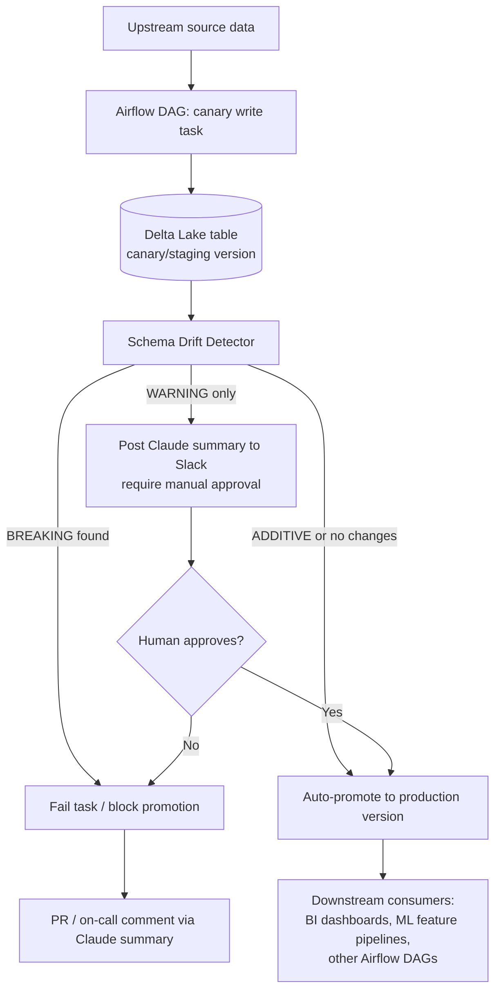

# Architecture

## Where this fits in a real pipeline

The intended deployment is as a gate between a canary write and a production
promotion in a Databricks + Airflow environment — not a standalone tool run
manually.

## Component breakdown

| Component | Responsibility | File |
|---|---|---|
| **Diff engine** | Pure, deterministic comparison of two schemas. No I/O, no LLM calls — fully unit-testable in isolation. | `src/schema_diff.py` |
| **Delta integration** | Thin adapter that pulls two versions of a real Delta table's schema and hands them to the diff engine. | `src/schema_diff.py::diff_from_delta_table` |
| **LLM summary layer** | Takes the structured `DriftReport` (already-classified, already-correct) and turns it into a Slack-ready narrative with a promote/hold verdict. Deliberately kept separate from the diff logic — correctness must never depend on the LLM. | `src/llm_summary.py` |
| **CLI / CI gate** | Orchestrates the above and exposes `--fail-on-breaking` so this can be a hard gate in Airflow (`BashOperator` / `PythonOperator`) or GitHub Actions. | `src/cli.py` |

## Design decisions worth calling out

**Why keep the LLM out of the classification logic.**
Severity classification (BREAKING vs. WARNING vs. ADDITIVE) is deterministic
and rule-based, not model-generated. An LLM is well suited to *explaining*
a diff in natural language, but a promotion gate that decides whether
production traffic is safe should not depend on a model's judgment for the
underlying fact of "was a column dropped." The diff engine has zero
dependency on `anthropic` and is fully covered by unit tests; the LLM layer
is an optional enrichment on top.

**Why JSON schemas as the core interface, not just Spark `StructType`.**
Accepting a plain JSON schema representation (rather than requiring a live
`SparkSession`) means:
- The diff engine can be unit tested without spinning up Spark
- It can run in lightweight CI environments
- It's usable against schema snapshots exported from other systems (e.g. a
  schema registry, a dbt `manifest.json`, or Unity Catalog metadata) without
  rewriting the core logic

**Type-widening allowlist instead of a strict equality check.**
A naive "any type change is breaking" rule would create constant false
alarms for legitimate, safe evolutions like `integer → long`. The
`SAFE_WIDENING` set in `schema_diff.py` encodes which promotions are
generally safe for downstream readers, based on common Spark type-coercion
behavior — this is the kind of judgment call that turns a noisy linter into
something a team will actually trust and not disable.

## What a production version would add

See the "What I'd add next" section in [`README.md`](./README.md) — in
short: lineage-weighted severity, historical drift tracking, and a
configurable policy file rather than hardcoded rules.
